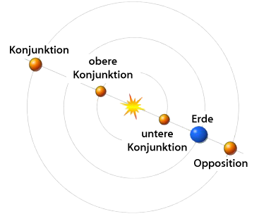

==============================
Videoastronomie für die Schule
==============================

Einführung
----------

- Seeing beschreiben

- Verschiedene Lösungstrategien: Hubble, Adaptive Optik, Videoastronomie

- Beschreibung Videoastronomie

Materialien
-----------

- Laptop 32 bit mit Giotto

- Teleskop

- Webcam mit Adapter

Motivauswahl
------------

- Was kann man mit Videoastronomie fotografieren und was nicht?

- Erklärung Opposition / Konjunktion

    Quelle: http://commons.wikimedia.org/wiki/File:Konjunktion.png

Vorbereitung
------------

- Motiv überlegen + richtige Zeit abwarten :-)

- Kamera ausprobieren: mit Giotto ein kurzes Video aufnehmen

- Teleskop aufbauen und einnorden (siehe eigene Anleitung)

- Stromversorgung für Laptop + Montierung

- Motiv finden

Aufnahme
--------

- Motiv bei kleiner und später bei großer Vergrößerung durch Okular anschauen.
  Dabei Teleskop genau ausrichten und Nachführung überprüfen.

- Okular abnehmen und durch Webcam ersetzen. Dabei möglichst wenig wackeln.
  Aufnehmen, wie in (...) beschrieben.

- Nach den Aufnahmen alles wieder sauber abbauen und aufräumen. Beschrieben in
  (...)

Webcams
-------

- Tuocam 2 pro von Philips
- TS Optics CCD Kamera (TSSSI_) scheint ein Nachfolger der Tuocam von Philips
  zu sein. Ich weiß aber nicht, ob sie ohne weiteres mit Giotto funktioniert.

Links
-----

- Eine Episode von Sternstunde_ beschreibt Videoastronomie.
  Ich habe sie mir aber noch nicht angesehen.
- Software für Bearbeitung und Aufnahme in der Videoastronomie,
  Giotto_.
- Ausführliche Anleitung_ von Giotto.

.. _Anleitung: http://www.giotto-software.de/technik_dt.htm
.. _Giotto: http://www.giotto-software.de/giotto.htm
.. _Sternstunde: http://www.youtube.com/watch?v=lorhPqmGczQ 
.. _TSSSI: http://www.teleskop-express.de/shop/product_info.php?products_id=1778
